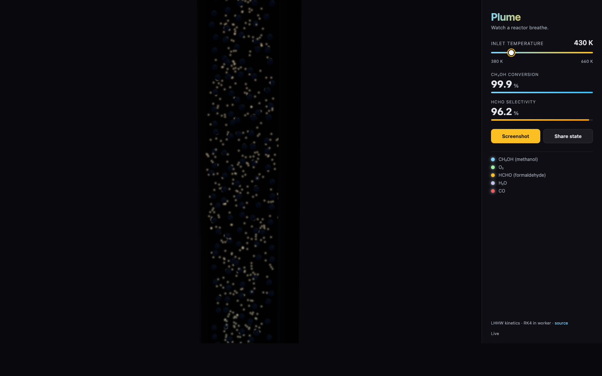

# Plume

> Watch a reactor breathe.

A single-page interactive WebGL piece that visualizes a stylized 2D
axisymmetric packed bed reactor for the catalytic partial oxidation of
methanol to formaldehyde. Particles enter from the top, react over the
catalyst bed, and exit as formaldehyde and water at the bottom — color
encodes species composition along the column.

Live: **[plume.defne.dev](https://plume.defne.dev)**



## What's interesting

- **Real kinetics, live.** A tiny RK4 solver runs in a web worker, seeded
  with the LHHW (Langmuir–Hinshelwood–Hougen–Watson) rate expressions from
  [formaldehyde-reactor-design](https://github.com/defnalk/formaldehyde-reactor-design).
  Drag the inlet temperature slider and conversion + selectivity update
  immediately.
- **Color is the answer.** A 1D species-color LUT is computed from the
  solved profile each time and uploaded as a `DataTexture` for the particle
  shader to sample by axial position. So the gradient you see on screen
  *is* the reaction profile.
- **Custom GLSL shaders.** Particles are a single instanced point cloud
  with a custom vertex/fragment shader. The outlet heat haze is a separate
  shader-only plane driven by fbm noise.
- **Reduced motion respected.** `prefers-reduced-motion` freezes particle
  flow and haze advection.

## Stack

- Vite + React + TypeScript
- [`@react-three/fiber`](https://github.com/pmndrs/react-three-fiber) +
  [`@react-three/drei`](https://github.com/pmndrs/drei) for the scene graph
  and `OrbitControls`
- Custom GLSL shaders (no postprocessing)
- A web worker doing RK4 integration of the 5-species packed bed ODE

## Controls

| Control          | Behavior                                        |
|------------------|-------------------------------------------------|
| Slider           | Inlet temperature, 380–660 K                     |
| Drag canvas      | Orbit                                           |
| Scroll canvas    | Zoom (clamped)                                  |
| Screenshot       | Downloads the current frame as PNG              |
| Share state      | Copies a deep link with the current temperature |

## Reaction system

```
Reaction 1:  CH3OH + 0.5 O2  -->  HCHO + H2O    (desired, LHHW)
Reaction 2:  HCHO  + 0.5 O2  -->  CO   + H2O    (undesired, LHHW)
```

LHHW rate expressions and parameters are pulled directly from
`RE_Group20_Part3ab.m` of the original MATLAB study.

## Run locally

```bash
npm install
npm run dev
```

## Deploy

The repo is Vercel-ready. Push to GitHub, import as a Vite project, and
point `plume.defne.dev` at the deployment.

```bash
npm run build && npm run preview
```

## License

MIT — see [LICENSE](./LICENSE).
